# Filipino Cookbook API

## Description

The Filipino Cookbook API is a RESTful API developed using PHP, Slim Framework, and MySQL. It provides JSON data about Filipino foods, food categories, ingredients, and food origins. The API demonstrates RESTful web service development with token-based authentication and is intended for educational purposes.

---

## Repository Information

**Repository Name**

```
filipino-cookbook-api-devillena
```

**Repository Description**

A RESTful Filipino Cookbook API developed using PHP, Slim Framework, and MySQL for API Development laboratory activities.

---

## Features

- Retrieve all Filipino foods
- Retrieve a specific food by ID
- Search foods by name
- Retrieve all food categories
- Retrieve all ingredients
- Add a new food with ingredients
- Token-based authentication
- JSON responses
- Category summary endpoint
- Random Filipino food endpoint
- Input validation for requests

---

## Technologies Used

- PHP 8.x
- Slim Framework
- MySQL
- Composer
- JSON
- Apache
- XAMPP
- Thunder Client
- Git
- GitHub

---

## Repository Contents

This repository contains:

- Complete Filipino Cookbook API source code
- SQL database file (`filipino_cookbook_api.sql`)
- `composer.json`
- `composer.lock`
- API routes
- Database connection files
- Authentication and security files
- Configuration instructions
- `.gitignore`
- `README.md`

---

## Project Structure

```text
filipino-cookbook-api-devillena/
│── public/
│   ├── index.php
│   └── .htaccess
│── composer.json
│── composer.lock
│── filipino_cookbook_api.sql
│── config.example.php
│── README.md
│── .gitignore
```

---

# Installation Guide

### 1. Clone the repository

```bash
git clone https://github.com/airyl101/filipino-cookbook-api-devillena.git
```

### 2. Open the project folder

```bash
cd filipino-cookbook-api-devillena
```

### 3. Install Composer dependencies

```bash
composer install
```

### 4. Import the database

Import

```
filipino_cookbook_api.sql
```

into your MySQL server.

### 5. Create the configuration file

Copy

```
config.example.php
```

Rename it to

```
config.php
```

Update the values:

```php
<?php

$dbHost = "localhost";
$dbName = "filipino_cookbook_api";
$dbUser = "root";
$dbPass = "";
```

### 6. Start XAMPP

Start:

- Apache
- MySQL

### 7. Access the API

```
http://localhost/filipino-cookbook-api/public
```

---

## Database Setup

### Database Name

```
filipino_cookbook_api
```

### SQL File

```
filipino_cookbook_api.sql
```

### Tables

- foods
- categories
- origins
- ingredients
- food_ingredients

### Table Relationships

```
categories --> foods <-- origins
                  |
                  |
          food_ingredients
                  |
                  |
            ingredients
```

Import the SQL file into MySQL before running the API.

---

# Configuration Instructions

Example configuration:

```php
<?php

$dbHost = "localhost";
$dbName = "filipino_cookbook_api";
$dbUser = "YOUR_DATABASE_USERNAME";
$dbPass = "YOUR_DATABASE_PASSWORD";
```

The actual `config.php` should **not** be uploaded.

Only upload:

```
config.example.php
```

---

# Security

The API uses:

- Bearer Token Authentication
- Input Validation
- Prepared Statements (PDO)

---

## Base URL

```
http://localhost/filipino-cookbook-api/public/api
```

---

## Authentication Instructions

This API uses **Bearer Token Authentication**.

### Required Header

```
Authorization: Bearer "YOUR_API_TOKEN"
```

### Accept Header

```
Accept: application/json
```

If the token is missing or invalid, the API returns:

```json
{
    "status": "error",
    "message": "Unauthorized access. Valid API token is required."
}
```

---

# API Endpoints

The following table summarizes all available endpoints of the Filipino Cookbook API.

| Method | Endpoint | Description | Authentication |
|--------|----------|-------------|----------------|
| GET | `/` | Display the public welcome message of the API. | No |
| GET | `/api/foods` | Retrieve all Filipino foods together with their categories, origins, and ingredients. | Yes |
| GET | `/api/foods/{id}` | Retrieve a specific Filipino food using its ID. | Yes |
| GET | `/api/foods/search/{name}` | Search Filipino foods by name. | Yes |
| GET | `/api/categories` | Retrieve all food categories. | Yes |
| GET | `/api/ingredients` | Retrieve all ingredients. | Yes |
| POST | `/api/foods` | Add a new Filipino food together with its ingredients. | Yes |
| GET | `/api/categories/summary` | Display the total number of foods available in every category. | Yes |
| GET | `/api/foods/random` | Retrieve one randomly selected Filipino food. | Yes |

---

# API Documentation

The following section provides detailed information about every endpoint available in the Filipino Cookbook API.

---

## 1. Public Welcome

### Endpoint

```http
GET /
```

### Description

Returns a welcome message indicating that the API is running successfully.

### Authentication

Not required.

### Example Request

```http
GET http://localhost/filipino-cookbook-api/public/
```

### Example Response

```json
{
    "message": "Welcome to the Secured Filipino Cookbook API",
    "note": "Use a valid Bearer token to access /api endpoints."
}
```

### Result Description

This endpoint is used to verify that the API is running correctly before testing the protected endpoints.

---

## 2. Retrieve All Foods

### Endpoint

```http
GET /api/foods
```

### Description

Returns all Filipino foods stored in the database together with their category, origin, instructions, and ingredients.

### Required Headers

```http
Authorization: Bearer "YOUR_API_TOKEN"
Accept: application/json
```

### Example Request

```http
GET http://localhost/filipino-cookbook-api/public/api/foods
```

### Example Response

```json
[
   {
    "food_id": 1,
    "food_name": "Adobo",
    "category_name": "Main Dish",
    "origin_name": "Luzon",
    "instructions": "Simmer chicken with soy sauce, vinegar, garlic, and onion.",
    "ingredients": [
      "Chicken",
      "Soy Sauce",
      "Vinegar",
      "Garlic",
      "Onion"
    ]
  },
]
```

### Result Description

Successfully retrieves every Filipino food stored in the database together with its complete details.

---

## 3. Retrieve Food by ID

### Endpoint

```http
GET /api/foods/{id}
```

### Description

Returns the complete information of a specific Filipino food based on its ID.

### Required Headers

```http
Authorization: Bearer "YOUR_API_TOKEN"
Accept: application/json
```

### Example Request

```http
GET http://localhost/filipino-cookbook-api/public/api/foods/1
```

### Example Response

```json
{
    "food_id": 1,
    "food_name": "Adobo",
    "category_name": "Main Dish",
    "origin_name": "Luzon",
    "instructions": "Simmer chicken with soy sauce, vinegar, garlic, and onion.",
    "ingredients": [
        "Chicken",
        "Soy Sauce",
        "Garlic"
    ]
}
```

### Result Description

Returns the selected Filipino food together with its category, origin, cooking instructions, and ingredients.

---

## 4. Search Food by Name

### Endpoint

```http
GET /api/foods/search/{name}
```

### Description

Searches for Filipino foods whose names match the specified keyword.

### Required Headers

```http
Authorization: Bearer "YOUR_API_TOKEN"
Accept: application/json
```

### Example Request

```http
GET http://localhost/filipino-cookbook-api/public/api/foods/search/adobo
```

### Example Response

```json
[
    {
        "food_id": 1,
        "food_name": "Adobo",
        "category_name": "Main Dish",
        "origin_name": "Luzon",
        "instructions": "...",
        "ingredients": [
            "Chicken",
            "Soy Sauce",
            "Garlic"
        ]
    }
]
```

### Example Error Response

```json
{
    "status": "error",
    "message": "Search keyword cannot be empty."
}
```

### Result Description

Returns all foods whose names match the search keyword. If no matching records are found, an empty JSON array is returned.

---

## 5. Retrieve All Categories

### Endpoint

```http
GET /api/categories
```

### Description

Returns all food categories stored in the database.

### Required Headers

```http
Authorization: Bearer "YOUR_API_TOKEN"
Accept: application/json
```

### Example Request

```http
GET http://localhost/filipino-cookbook-api/public/api/categories
```

### Example Response

```json
[
    {
        "category_id": 1,
        "category_name": "Main Dish"
    },
    {
        "category_id": 2,
        "category_name": "Dessert"
    }
]
```

### Result Description

Returns every available food category in JSON format.

---

## 6. Retrieve All Ingredients

### Endpoint

```http
GET /api/ingredients
```

### Description

Returns all ingredients stored in the database.

### Required Headers

```http
Authorization: Bearer "YOUR_API_TOKEN"
Accept: application/json
```

### Example Request

```http
GET http://localhost/filipino-cookbook-api/public/api/ingredients
```

### Example Response

```json
[
    {
        "ingredient_id": 1,
        "ingredient_name": "Chicken"
    },
    {
        "ingredient_id": 2,
        "ingredient_name": "Garlic"
    }
]
```

### Result Description

Returns the complete list of ingredients available in the database.

---

## 7. Add New Food

### Endpoint

```http
POST /api/foods
```

### Description

Adds a new Filipino food together with its ingredients.

### Required Headers

```http
Authorization: Bearer "YOUR_API_TOKEN"
Content-Type: application/json
Accept: application/json
```

### Example Request Body

```json
{
    "food_name": "Tinola",
    "category_id": 1,
    "origin_id": 1,
    "instructions": "Boil chicken with ginger and vegetables.",
    "ingredient_ids": [1,2,5]
}
```

### Example Success Response

```json
{
    "status": "success",
    "message": "Food added successfully."
}
```

### Example Error Response

```json
{
    "status": "error",
    "message": "Missing required fields."
}
```

### Result Description

Creates a new food record together with its associated ingredients. The API returns **HTTP 201 Created** when the operation is successful.

---

## 8. Category Summary

### Endpoint

```http
GET /api/categories/summary
```

### Description

Returns the total number of foods available under each category.

### Required Headers

```http
Authorization: Bearer "YOUR_API_TOKEN"
Accept: application/json
```

### Example Request

```http
GET http://localhost/filipino-cookbook-api/public/api/categories/summary
```

### Example Response

```json
[
    {
        "category_name": "Main Dish",
        "total_foods": 8
    },
    {
        "category_name": "Dessert",
        "total_foods": 5
    }
]
```

### Result Description

Displays the number of foods that belong to every category in the database.

---

## 9. Random Filipino Food

### Endpoint

```http
GET /api/foods/random
```

### Description

Returns one randomly selected Filipino food from the database.

### Required Headers

```http
Authorization: Bearer "YOUR_API_TOKEN"
Accept: application/json
```

### Example Request

```http
GET http://localhost/filipino-cookbook-api/public/api/foods/random
```

### Example Response

```json
{
    "food_id": 5,
    "food_name": "Sinigang",
    "category_name": "Soup",
    "origin_name": "Luzon",
    "instructions": "...",
    "ingredients": [
        "Pork",
        "Tamarind",
        "Vegetables"
    ]
}
```

### Result Description

Returns one randomly selected Filipino food each time the endpoint is requested.

----


# HTTP Status Codes

The Filipino Cookbook API uses standard HTTP status codes to indicate the result of each request.

| Status Code | Meaning |
|-------------|---------|
| **200 OK** | The request was completed successfully. |
| **201 Created** | A new food record was successfully created. |
| **400 Bad Request** | The request contains invalid or missing parameters. |
| **401 Unauthorized** | Authentication failed because the Bearer Token is missing or invalid. |
| **404 Not Found** | The requested resource could not be found. |
| **500 Internal Server Error** | An unexpected error occurred while processing the request. |

---


# API Enhancements

To improve the functionality and security of the Filipino Cookbook API, additional features were implemented beyond the original laboratory requirements.

## 1. Category Summary Endpoint

### Endpoint

```http
GET /api/categories/summary
```

### Description

Returns the total number of Filipino foods available under each category.

### Purpose

This endpoint provides a quick summary of the available food categories and the number of foods belonging to each category.

### Example Response

```json
[
    {
        "category_name": "Main Dish",
        "total_foods": 8
    },
    {
        "category_name": "Dessert",
        "total_foods": 5
    }
]
```

---

## 2. Random Filipino Food Endpoint

### Endpoint

```http
GET /api/foods/random
```

### Description

Returns one randomly selected Filipino food from the database.

### Purpose

This endpoint allows users to discover a random Filipino dish without searching manually.

### Example Response

```json
{
    "food_id": 5,
    "food_name": "Sinigang",
    "category_name": "Soup",
    "origin_name": "Luzon",
    "instructions": "Boil it for 10 minutes before adding condiments, and after it put your vegetable and boil it for 2 minutes. After boiling, add the sinigang mix and wait for it to cook.",
    "ingredients": [
        "Pork",
        "Tamarind",
        "Vegetables"
    ]
}
```

---

## 3. Input Validation

The API validates incoming data before processing requests to improve security and prevent invalid records from being inserted into the database.

The validation checks include:

- Required request fields
- Empty input values
- Numeric ID validation
- Proper JSON request format

### Example Error Response

```json
{
    "status": "error",
    "message": "Missing required fields."
}
```

If invalid data is submitted, the API immediately returns an appropriate error response instead of processing the request.

---

# Security Features

The Filipino Cookbook API implements several security mechanisms to protect the application and ensure reliable data processing.

## Bearer Token Authentication

All protected endpoints require a valid Bearer Token.

### Required Header

```http
Authorization: Bearer "YOUR_API_TOKEN"
```

### Unauthorized Response

```json
{
    "status": "error",
    "message": "Unauthorized access. Valid API token is required."
}
```

Only authenticated users can access the protected API endpoints.

---

## Input Validation

Before processing requests, the API validates all user input to ensure that only valid data is accepted.

Validation includes:

- Required fields
- Empty values
- Numeric IDs
- Proper JSON request format

### Example Validation Error

```json
{
    "status": "error",
    "message": "Missing required fields."
}
```

---

## Prepared Statements

The API uses **PHP PDO Prepared Statements** for all database operations.

This helps protect the application against SQL Injection attacks by separating SQL queries from user input.

---

## JSON Responses

All endpoints return data in **JSON format** together with appropriate HTTP status codes, making the API easy to integrate with web and mobile applications.

---

# Testing Evidence

The Filipino Cookbook API was tested using **Thunder Client** in Visual Studio Code to verify that all endpoints function correctly, return valid JSON responses, and enforce authentication and input validation.

## Successful Endpoint Testing

### 1. Public Welcome Endpoint

**Endpoint:** `GET /`

**Description:** Verifies that the API is running successfully by returning a welcome message.

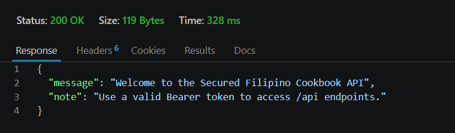

---

### 2. Retrieve All Foods

**Endpoint:** `GET /api/foods`

**Description:** Successfully retrieves all Filipino foods together with their categories, origins, cooking instructions, and ingredients.

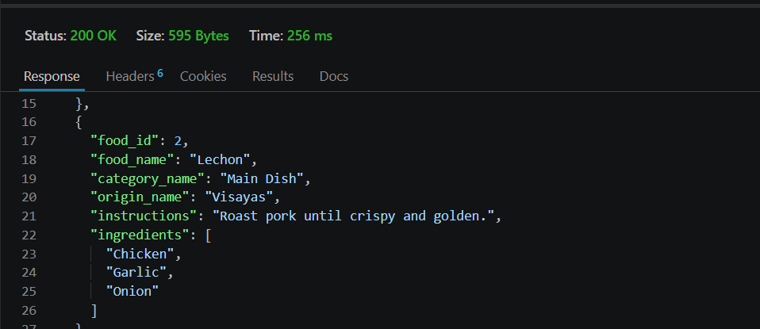

---

### 3. Retrieve Food by ID

**Endpoint:** `GET /api/foods/{id}`

**Description:** Successfully returns the complete details of a selected Filipino food using its unique ID.

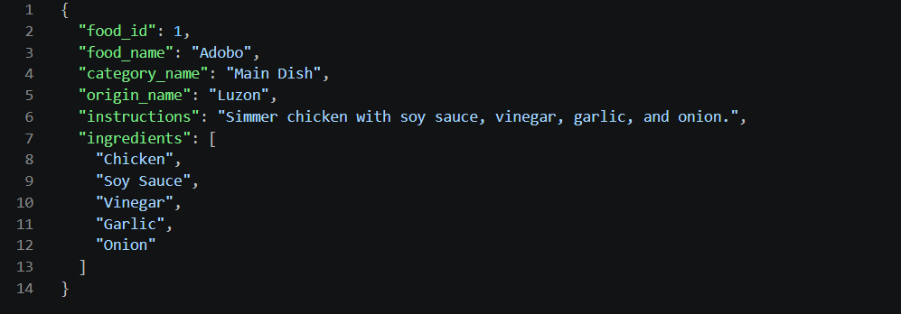

---

### 4. Search Food by Name

**Endpoint:** `GET /api/foods/search/{name}`

**Description:** Successfully searches for Filipino foods whose names match the specified keyword.

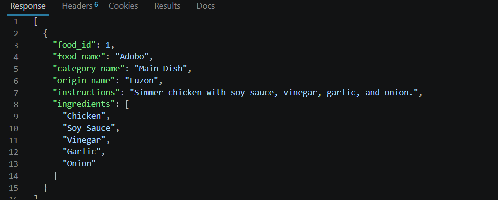

---

### 5. Retrieve All Categories

**Endpoint:** `GET /api/categories`

**Description:** Successfully retrieves all available food categories stored in the database.

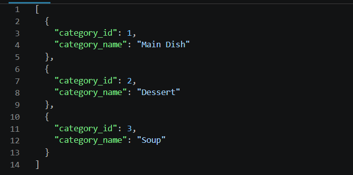

---

### 6. Retrieve All Ingredients

**Endpoint:** `GET /api/ingredients`

**Description:** Successfully retrieves all ingredients available in the database.

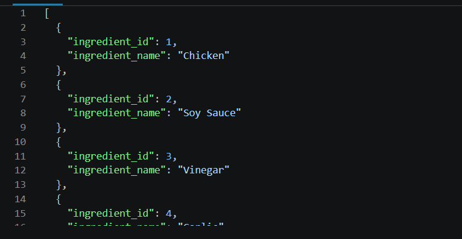

---

### 7. Add New Food

**Endpoint:** `POST /api/foods`

**Description:** Successfully inserts a new Filipino food record together with its corresponding ingredients.

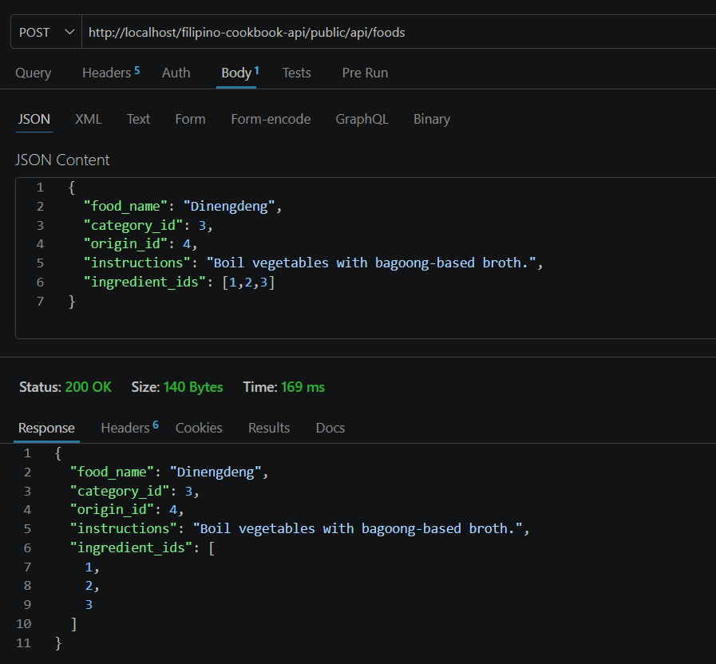

---

### 8. Category Summary

**Endpoint:** `GET /api/categories/summary`

**Description:** Successfully returns the total number of foods available under each food category.

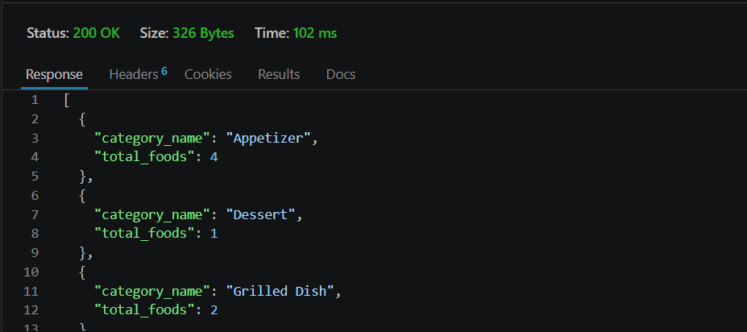

---

### 9. Random Filipino Food

**Endpoint:** `GET /api/foods/random`

**Description:** Successfully returns one randomly selected Filipino food from the database.

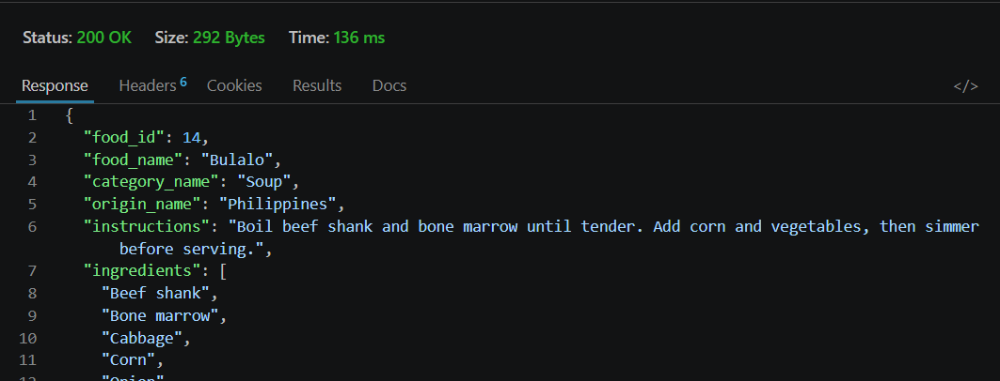

---

## Security Testing

### 10. Input Validation

**Endpoint:** `POST /api/foods`

**Description:** Demonstrates that the API validates incoming requests and rejects invalid or incomplete input by returning a **400 Bad Request** response.

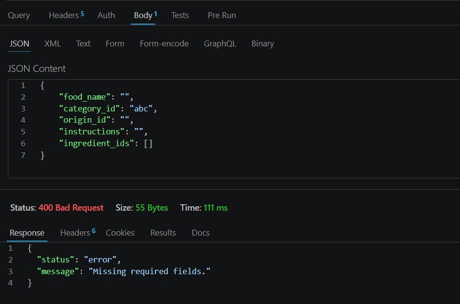

---

### 11. Unauthorized Access

**Endpoint:** Protected API Endpoints

**Description:** Demonstrates that requests without a valid Bearer Token are rejected with a **401 Unauthorized** response.

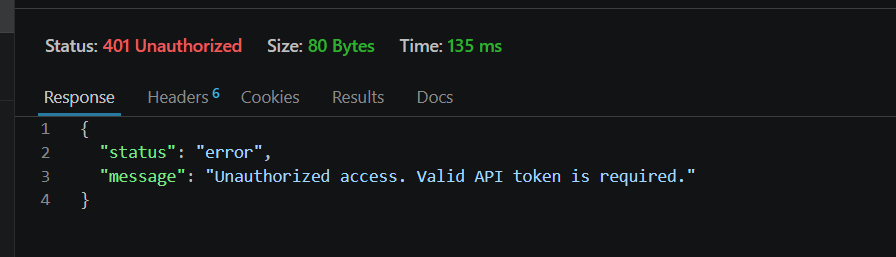

---

# Repository Verification Checklist

The following verification steps were completed to ensure that the project is fully functional and can be used by another student.

- ✅ Repository can be cloned successfully.
- ✅ Composer dependencies install correctly using `composer install`.
- ✅ SQL database imports successfully.
- ✅ Database connection is configured properly.
- ✅ Apache and MySQL services start successfully using XAMPP.
- ✅ The API runs without errors.
- ✅ All endpoints return valid JSON responses.
- ✅ Bearer Token authentication works correctly.
- ✅ Input validation and error handling function as expected.
- ✅ No sensitive credentials or private configuration files are included in the repository.
- ✅ Installation and configuration instructions are complete.
- ✅ Another student can install, configure, and test the API by following the README documentation.

---

# Developer Information

| Information | Details |
|------------|---------|
| **Developer** | Airyl Rhyn R. Devillena |
| **Course** | Bachelor of Science in Information Technology |
| **University** | Don Mariano Marcos Memorial State University |
| **GitHub Username** | airyl101 |
| **Repository Name** | filipino-cookbook-api-devillena |
| **Repository Link** | https://github.com/airyl101/filipino-cookbook-api-devillena |
| **Date Completed** | August 2026 |

---

# License

This project was developed for educational purposes as part of the **API Development Laboratory Activities** for the Bachelor of Science in Information Technology program.

The Filipino Cookbook API is intended for learning, demonstration, and academic use only. Students and instructors are free to clone, install, modify, and use this project for educational purposes while giving appropriate credit to the original developer.